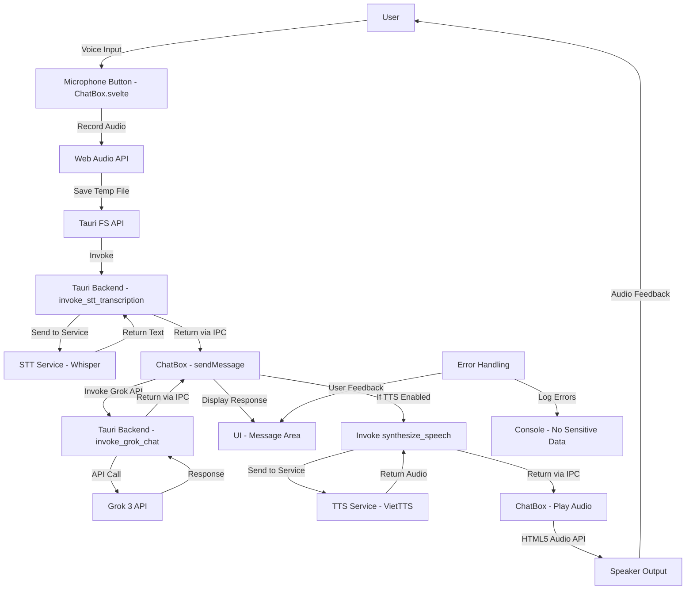

# Plan: Integrate STT-TTS into Chat Box for Voice Chat in Mivis Desktop Assistant

**Date:** 17/05/2025
**Sprint:** 2

## Objective
Enable voice chat functionality in the Mivis Tauri app (`/apps/assistant`) by integrating the existing Speech-to-Text (STT) and Text-to-Speech (TTS) packages into the AI chat box. This task builds on the completed text-based chat integration with Grok 3 API (Task 1 of Sprint 2) and fulfills Task 2 of Sprint 2 by allowing users to interact with the assistant via voice input and output.

## Architectural Fit
- **Frontend**: Enhance the existing Svelte component (`ChatBox.svelte`) to include voice interaction controls (microphone for recording, speaker toggle for playback).
- **Backend**: Extend Tauri Rust commands in `/apps/assistant/src-tauri/src/lib.rs` to handle STT transcription and TTS audio synthesis, leveraging existing implementations in `/packages/stt` and `/packages/tts`.
- **Shared Logic**: Utilize existing STT (`/packages/stt`) for transcription of voice input and TTS (`/packages/tts`) for audio output of AI responses.
- **Security**: Ensure no sensitive data is logged during voice processing, adhering to `.clinerules`.
- **Performance**: Maintain lightweight design (< 50MB RAM) by optimizing audio processing and playback.
- **Clean Structure**: Organize new voice-related functions in dedicated modules within `/src-tauri/src/` for maintainability.

## Detailed Plan

### Phase 1: UI Enhancements for Voice Interaction
- **File**: `/apps/assistant/src/lib/components/ChatBox.svelte`
- **Actions**:
  - Enable the placeholder microphone button (`<button>🎤</button>`) to start/stop audio recording for STT.
  - Enable the placeholder speaker icon (`<span>🔊</span>`) to toggle TTS playback of AI responses.
  - Add UI states for recording (`Recording...`), transcribing (`Transcribing...`), and playback (`Playing...`) to provide user feedback.
  - Use Web Audio API (`MediaRecorder`) to capture audio input in the browser, converting to WAV format if necessary before sending to backend.
  - Implement logic to play TTS audio responses using HTML5 Audio API, with a toggle to enable/disable auto-play.
- **Error Mitigation**: Handle recording permissions (prompt user if denied), timeout recording after 10 seconds, and display errors for failed transcriptions or playback.
- **Confidence**: 9/10 (UI elements are placeholders from previous task, need activation and logic)

### Phase 2: Backend Integration for STT
- **File**: `/apps/assistant/src-tauri/src/lib.rs`
- **Actions**:
  - Utilize the existing `invoke_stt_transcription` command (from STT integration in Sprint 1) to process audio input.
  - Ensure the command accepts audio data from the frontend, sends it to the STT service (`/packages/stt/src/stt_service.py`), and returns the transcribed text.
  - Log non-sensitive errors (e.g., "Failed to transcribe audio: timeout") without exposing audio data.
- **Error Mitigation**: Implement retry logic (3 attempts) for STT service failures, handle temporary file cleanup, and return user-friendly error messages to the frontend.
- **Confidence**: 8.5/10 (STT service is already integrated, needs testing with chat box flow)

### Phase 3: Backend Integration for TTS
- **File**: `/apps/assistant/src-tauri/src/lib.rs`
- **Actions**:
  - Utilize the existing `synthesize_speech` command (from TTS integration in Sprint 1) to convert AI text responses to audio.
  - Ensure the command sends text to the VietTTS service (`http://localhost:8298`) and returns audio data (`Vec<u8>`) to the frontend for playback.
  - Add a parameter to optionally specify voice (default to "diep-chi") if user preferences are implemented.
  - Log non-sensitive errors (e.g., "Failed to synthesize speech: service unavailable").
- **Error Mitigation**: Handle cases where VietTTS service is down with a fallback message in UI, implement timeout for synthesis requests (10s).
- **Confidence**: 8.5/10 (TTS service is integrated, needs testing with chat responses)

### Phase 4: Frontend Logic for Voice Chat Flow
- **File**: `/apps/assistant/src/lib/components/ChatBox.svelte`
- **Actions**:
  - Modify the `sendMessage` function to handle voice input:
    - When microphone button is clicked, start recording, save audio to temporary file via Tauri `fs` API.
    - Call `invoke_stt_transcription` with the audio file path, receive transcribed text.
    - Set transcribed text as input with `source: 'voice'` and send to Grok 3 API via existing `invoke_grok_chat` command.
  - Add logic for TTS playback:
    - On receiving AI response, if TTS toggle is enabled, call `synthesize_speech` with the response text.
    - Receive audio data, convert to `Blob`, and play using HTML5 Audio API.
  - Update Svelte stores to track voice-specific states (e.g., `isRecording`, `isPlayingTTS`).
- **Error Mitigation**: Handle transcription errors by displaying "Failed to understand voice input", ensure audio playback doesn't overlap by stopping previous playback.
- **Confidence**: 8/10 (needs testing for seamless flow from STT to API to TTS)

### Phase 5: Testing
- **Workspace**: `/apps/assistant`
- **Actions**:
  - Jest tests for frontend logic in `ChatBox.svelte`:
    - Mock Tauri `invoke` calls for STT and TTS.
    - Test voice input flow (record -> transcribe -> send) and TTS playback toggle.
  - Rust tests for backend commands:
    - Test `invoke_stt_transcription` with sample audio files.
    - Test `synthesize_speech` with mock responses from VietTTS.
  - Manual end-to-end testing:
    - Voice input -> STT -> text -> Grok API -> response -> TTS -> audio output.
    - Test edge cases (no microphone permission, VietTTS service down).
  - Target 80% test coverage as per `.clinerules`.
- **Error Mitigation**: Use mock audio data for consistent testing, simulate service failures to ensure robust error handling.
- **Confidence**: 8/10 (comprehensive testing needed for voice flow)

### Phase 6: Documentation
- **Actions**:
  - Create this plan document (`/docs/plans/integrate-stt-tts-chatbox.md`).
  - Update Memory Bank post-implementation:
    - `activeContext.md`: "Integrated STT-TTS into chat box for voice chat functionality."
    - `progress.md`: "Voice chat integration completed, testing in progress."
  - Update `apps/assistant/index-assistant-temp.md`:
    ```
    # Assistant App
    - **Feature**: Voice Chat with STT-TTS
    - **Description**: Enable voice interaction in chat box using Whisper for STT and VietTTS for TTS.
    - **Status**: In Progress
    ```
  - Update `README.md` and `CHANGELOG.md` if required per `.clinerules` after task completion.
- **Error Mitigation**: Ensure no sensitive data in documentation, commit docs separately from code changes.
- **Confidence**: 9/10

## Error Mitigation Strategies
- **Audio Recording Issues**: Prompt user for microphone access, fallback to text input if denied, timeout recording to prevent hanging.
- **STT/TTS Service Failures**: Implement retry logic (3 attempts, exponential backoff), display user-friendly errors in UI if services are unavailable.
- **UI Responsiveness**: Use async operations for recording and playback to prevent UI freeze, limit audio playback to one at a time.
- **Performance**: Optimize audio data handling to keep RAM usage under 50MB, monitor with `process.memoryUsage()` if needed during testing.

## Visual Representation


## Implementation Steps (ACT MODE)
1. Use `write_to_file` to create this plan file (`/docs/plans/integrate-stt-tts-chatbox.md`).
2. Use `read_file` to examine current content of `ChatBox.svelte`, STT, and TTS implementation files.
3. Use `replace_in_file` to update `ChatBox.svelte` with voice UI controls and logic for STT-TTS flow.
4. Use `replace_in_file` or `write_to_file` to update or create necessary Tauri commands in `/src-tauri/src/lib.rs` for STT and TTS integration if modifications are needed beyond existing commands.
5. Write Jest tests for frontend logic and Rust tests for backend commands.
6. Update documentation in Memory Bank files (`activeContext.md`, `progress.md`) to reflect task completion.
7. Use `attempt_completion` to present the result of the integration.

## Notes
- **Streaming**: Consider streaming TTS for long responses in future iterations, currently use non-streaming for simplicity.
- **Dependencies**: Leverage existing `reqwest` for backend HTTP requests, ensure STT/TTS services are running (STT as sidecar, TTS as Docker).
- **Confidence**: 8.5/10 (integration builds on existing STT/TTS setups, needs thorough testing for voice chat flow).

---
This plan ensures a structured approach to integrating STT-TTS into the chat box, maintaining the Mivis project's standards for security, modularity, and performance while completing Task 2 of Sprint 2.
